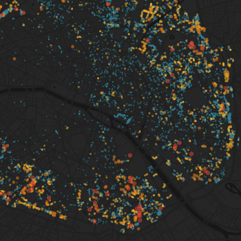
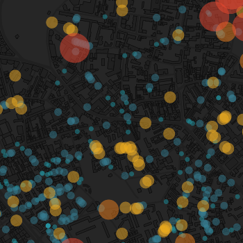

# Social housing in Paris

## Données

Les données proviennent du [RPLS](http://www.statistiques.developpement-durable.gouv.fr/sources-methodes/enquete-nomenclature/1542/0/repertoire-logements-locatifs-bailleurs-sociaux-rpls.html) 2014 (Répertoire des logements locatifs des bailleurs sociaux). Répertoire auquel nous avons tous accès, sous réserve d'en faire la demande. 

## Outils utilisés

* La librairie [csvkit 0.9.1](http://csvkit.readthedocs.org/en/0.9.1/index.html) (avec csvcut, csvjoin, etc.)
* Quelques [sed](http://www.grymoire.com/Unix/Sed.html) 's/x/y/g'
* L'API de la [Base Adresse Nationale](http://adresse.data.gouv.fr) pour la géolocalistion des adresses
* [Mapbox Studio](https://www.mapbox.com/mapbox-studio/) pour la partie cartographie

## Géolocalisation

* Le SCORE_GEO correspond à "l'indice de confiance" renvoyé par l'API de la Base Adresse Nationale.
* Certaines adresses ont été redressées manuellement.
* Aucune garantie d'exactitude quant au résulat final.

## A faire

* Faire le même travail sur les autres départements d'Ile de France.
* Permettre une représentation cartographique par type de financement (PLAI, PLUS, PLS, PLI)
* ...
